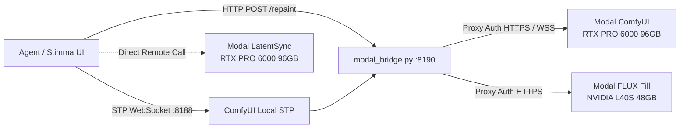

# Manuel d'Installation et Déploiement Modal (MAN_MODAL)

Guide complet pour configurer automatiquement l'infrastructure GPU **Modal** (ComfyUI MiniMax H3, FLUX.1 Fill Repaint, LatentSync LipSync) pour votre agent **Stimma / Antigravity**.

---

## Sommaire

1. [Vue d'Ensemble & Architecture](#1-vue-densemble--architecture)
2. [Prérequis (Clés & Tokens)](#2-prérequis-clés--tokens)
3. [Installation Rapide en 1 Commande (Recommandé)](#3-installation-rapide-en-1-commande-recommandé)
4. [Installation Manuelle Étape par Étape](#4-installation-manuelle-étape-par-étape)
5. [Configuration de l'Agent Stimma](#5-configuration-de-lagent-stimma)
6. [Commandes du Quotidien](#6-commandes-du-quotidien)
7. [Gestion des Volumes & Modèles Distants](#7-gestion-des-volumes--modèles-distants)
8. [Résolution des Problèmes (Troubleshooting)](#8-résolution-des-problèmes-troubleshooting)

---

## 1. Vue d'Ensemble & Architecture

Le système exécute tous les modèles lourds et calculs CUDA exclusivement sur **Modal Cloud** :
- **0 Go de poids téléchargés sur votre machine locale**.
- **Scale-to-Zero strict** : après chaque génération, Modal libère le GPU après 2 secondes d'inactivité (`min_containers=0`, `scaledown_window=2`). Aucun coût au repos.
- **Passerelle locale authentifiée (`modal_bridge.py`)** : assure le routage sécurisé entre l'agent local (protocole STP sur `ws://127.0.0.1:8188/stp-v1` et `http://127.0.0.1:8190/repaint`) et les conteneurs Modal protégés.



---

## 2. Prérequis (Clés & Tokens)

Vous n'avez besoin que de **deux comptes / tokens** :

### A. Clé API Modal (`MODAL_TOKEN_ID` & `MODAL_TOKEN_SECRET`)
1. Créez un compte sur [modal.com](https://modal.com).
2. Rendez-vous dans **Settings > API Tokens** et créez un token.
3. Vous obtenez un `Token ID` (`ak-...`) et un `Token Secret` (`as-...`).

### B. Token Hugging Face (`HF_TOKEN`)
1. Créez un compte sur [huggingface.co](https://huggingface.co).
2. Acceptez les conditions d'utilisation du modèle [black-forest-labs/FLUX.1-Fill-dev](https://huggingface.co/black-forest-labs/FLUX.1-Fill-dev).
3. Générez un token en lecture dans **Settings > Access Tokens** (`hf_...`).

---

## 3. Installation Interactive & Automatisée (Recommandé)

### Option A : Assistant Interactif (CLI / Codex / Terminal)

Idéal pour être guidé étape par étape directement dans votre CLI de code ou terminal :

```bash
# Lancer l'assistant interactif pas-à-pas
python3 bin/setup-interactive.py
# ou
./bin/setup-modal.sh --interactive
```

L'assistant interactif :
1. Détecte ou installe automatiquement `modal`.
2. Vérifie la session active ou invite à saisir le `MODAL_TOKEN_ID` et `MODAL_TOKEN_SECRET` (avec masquage sécurisé des mots de passe).
3. Demande votre token `HF_TOKEN` et configure le secret distant sur Modal.
4. Génère les clés de sécurisation locale pour la passerelle.
5. Permet de choisir les conteneurs à déployer (H3, Repaint FLUX.1 Fill, LatentSync).
6. Télécharge directement les poids dans les volumes cloud Modal.

### Option B : 1-Ligne Non Interactive (pour Agents autonomes & Scripts)

Si votre agent dispose déjà des variables d'environnement :

```bash
HF_TOKEN="hf_votre_token" \
MODAL_TOKEN_ID="ak_votre_token_id" \
MODAL_TOKEN_SECRET="as_votre_token_secret" \
./bin/setup-modal.sh
```

### Option C : Via Codex CLI / Antigravity CLI

Si vous pilotez l'installation via Codex CLI ou un agent autonome :

```bash
# Exécution directe via Codex CLI
codex exec "python3 bin/setup-interactive.py --non-interactive --hf-token 'hf_...' --modal-token-id 'ak-...' --modal-token-secret 'as-...'"
```

---

## 4. Installation Manuelle Étape par Étape

Si vous préférez exécuter chaque étape manuellement :

### Étape 1 : Installer le CLI Modal
```bash
pip install modal
# ou avec uv :
uv tool install modal
```

### Étape 2 : Configurer les identifiants Modal
```bash
modal token set --token-id <VOTRE_TOKEN_ID> --token-secret <VOTRE_TOKEN_SECRET>
```

### Étape 3 : Créer le Secret Hugging Face sur Modal
```bash
modal secret create huggingface HF_TOKEN="<VOTRE_HF_TOKEN>" --force
```

### Étape 4 : Configurer le token proxy local
Créez le fichier `~/.config/adp-comfy/modal-proxy-token.json` avec des identifiants de protection :
```json
{
  "Modal-Key": "key_secret_local",
  "Modal-Secret": "sec_secret_local"
}
```
Puis protégez les droits :
```bash
chmod 600 ~/.config/adp-comfy/modal-proxy-token.json
```

### Étape 5 : Déployer les conteneurs Modal
```bash
# 1. ComfyUI + MiniMax H3 + Music 3
modal deploy --strategy recreate modal_h3.py

# 2. FLUX.1 Fill Repaint
modal deploy stimma/cloud_repaint/repaint_service.py

# 3. Maya LatentSync 1.6
modal deploy modal_latentsync.py
```

### Étape 6 : Télécharger les modèles dans les Volumes Modal
```bash
# Modèles MiniMax H3 & Music 3
modal run modal_h3.py::download_models
modal run modal_h3.py::download_music_models

# Modèle FLUX.1 Fill
modal run stimma/cloud_repaint/repaint_service.py::download_models

# Modèle LatentSync
modal run modal_latentsync.py::download_models
```

---

## 5. Configuration de l'Agent Stimma

Pour que l'agent Stimma communique avec le cluster Modal, assurez-vous que la configuration locale contient le provider websocket.

Fichier de configuration de dev (`~/Library/Application Support/ai.stimma.stimma.debug/default/config.yaml` ou `stimma/config.default.yaml`) :

```yaml
tool_providers:
  - id: comfyui-modal-h3
    type: websocket
    url: ws://127.0.0.1:8188/stp-v1
    enabled: true
```

Les workflows exposés à l'agent incluent :
- `minimax_h3_t2v` / `minimax_h3_t2v_turbo` (Texte vers Vidéo)
- `minimax_h3_i2v` / `minimax_h3_i2v_turbo` (Image vers Vidéo)
- `minimax_h3_r2v` / `minimax_h3_r2v_turbo` (Références visuelles multiples vers Vidéo)
- `minimax_music3_t2a` (Texte vers Musique)
- `flux_fill_repaint` (Inpainting / Repaint local relayé sur Modal)

---

## 6. Commandes du Quotidien

| Action | Commande | Description |
| :--- | :--- | :--- |
| **Démarrer la passerelle** | `bin/start-gateway.sh` | Lance le proxy bridge (`:8190`) et le serveur STP ComfyUI (`:8188`) avec auto-restart. |
| **Démarrer Stimma** | `bin/start-stimma.sh` | Lance l'interface utilisateur Stimma en mode développement. |
| **Statut & Facturation** | `bin/status.sh` | Affiche les conteneurs actifs et la consommation GPU du jour en dollars. |
| **Arrêt d'urgence** | `bin/emergency-stop.sh` | Coupe immédiatement tous les conteneurs Modal distants actifs. |

---

## 7. Gestion des Volumes & Modèles Distants

Les poids restent stockés sur les disques persistants Modal (Volumes) :
- `comfyui-minimax-h3-models` (~50 Go) : Poids H3, Turbo LoRA, Text Encoders, VAE, Music 3.
- `stimma-flux-fill-models` (~35 Go) : Poids FLUX.1 Fill Dev bfloat16.
- `maya-latentsync-checkpoints` (~5 Go) : Checkpoint UNet LatentSync & Whisper tiny.

### Vérifier l'inventaire distant sans démarrer de GPU :
```bash
modal run modal_h3.py::model_inventory
```

---

## 8. Résolution des Problèmes (Troubleshooting)

### A. Erreur `Modal proxy token is missing`
Exécutez `bin/setup-modal.sh` ou créez le fichier `~/.config/adp-comfy/modal-proxy-token.json`.

### B. Erreur 403 / 401 sur le téléchargement de FLUX Fill
Vérifiez que votre `HF_TOKEN` est valide et que vous avez accepté la licence sur [black-forest-labs/FLUX.1-Fill-dev](https://huggingface.co/black-forest-labs/FLUX.1-Fill-dev).
Mettez à jour le secret Modal :
```bash
modal secret create huggingface HF_TOKEN="hf_..." --force
```

### C. Premier démarrage lent (Cold Start)
Au premier appel après une période d'inactivité, Modal provisionne l'instance GPU et charge les modèles (~15 à 30 secondes). Les générations suivantes sur le conteneur chaud sont quasi-instantanées.

### D. Redémarrage propre en cas de blocage
1. Arrêtez `bin/start-gateway.sh` avec `Ctrl+C`.
2. Lancez `bin/emergency-stop.sh` pour stopper les conteneurs distants.
3. Relancez `bin/start-gateway.sh`.
