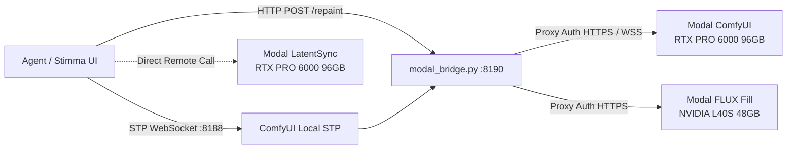

# Manuel d'Installation et Déploiement Modal (MAN_MODAL)

Guide complet pour configurer automatiquement l'infrastructure GPU **Modal** (ComfyUI MiniMax H3, FLUX.1 Fill Repaint, LatentSync LipSync et TRELLIS.2) pour votre agent **Stimma / Codex**.

Stimma fonctionne sans compte Stimma. Le chat utilise la session ChatGPT déjà
gérée par Codex CLI ; aucune clé API LLM n'est nécessaire. Modal et Hugging
Face restent des services séparés, utilisés uniquement pour les outils GPU.

---

## Sommaire

1. [Vue d'Ensemble & Architecture](#1-vue-densemble--architecture)
2. [Prérequis (Clés & Tokens)](#2-prérequis-clés--tokens)
3. [Installation Rapide en 1 Commande (Recommandé)](#3-installation-rapide-en-1-commande-recommandé)
4. [Installation Manuelle Étape par Étape](#4-installation-manuelle-étape-par-étape)
5. [Configuration de l'Agent Stimma](#5-configuration-de-lagent-stimma)
6. [Commandes du Quotidien](#6-commandes-du-quotidien)
7. [Gestion des Volumes & Modèles Distants](#7-gestion-des-volumes--modèles-distants)
8. [Résolution des Problèmes (Troubleshooting)](#8-résolution-des-problèmes-troubleshooting)

---

## 1. Vue d'Ensemble & Architecture

Le système exécute tous les modèles lourds et calculs CUDA exclusivement sur **Modal Cloud** :
- **0 Go de poids téléchargés sur votre machine locale**.
- **Scale-to-Zero strict** : après chaque génération, Modal libère le GPU après 2 secondes d'inactivité (`min_containers=0`, `scaledown_window=2`). Aucun coût au repos.
- **Passerelle locale authentifiée (`modal_bridge.py`)** : assure le routage sécurisé entre l'agent local (protocole STP sur `ws://127.0.0.1:8188/stp-v1` et `http://127.0.0.1:8190/repaint`) et les conteneurs Modal protégés.



---

## 2. Prérequis (Clés & Tokens GPU)

MiniMax H3 vidéo requiert uniquement les identifiants Modal. Un compte
Hugging Face est optionnel pour les extras sous licence :

### A. Clé API Modal (`MODAL_TOKEN_ID` & `MODAL_TOKEN_SECRET`)
1. Créez un compte sur [modal.com](https://modal.com).
2. Rendez-vous dans **Settings > API Tokens** et créez un token.
3. Vous obtenez un `Token ID` (`ak-...`) et un `Token Secret` (`as-...`).

### B. Token Hugging Face optionnel (`HF_TOKEN`)

Ce token n'est pas requis pour MiniMax H3 vidéo. Il active uniquement les
extras sous licence Repaint FLUX.1 Fill et TRELLIS.2.

1. Créez un compte sur [huggingface.co](https://huggingface.co).
2. Acceptez les conditions d'utilisation du modèle [black-forest-labs/FLUX.1-Fill-dev](https://huggingface.co/black-forest-labs/FLUX.1-Fill-dev).
3. Générez un token en lecture dans **Settings > Access Tokens** (`hf_...`).

---

## 3. Installation Interactive & Automatisée (Recommandé)

### Option A : Assistant Interactif (CLI / Codex / Terminal)

Idéal pour être guidé étape par étape directement dans votre CLI de code ou terminal :

```bash
# Lancer l'assistant interactif pas-à-pas
infra/bin/bootstrap-local.sh
python3 infra/bin/setup-interactive.py
# ou
./infra/bin/setup-modal.sh --interactive
```

L'assistant interactif :
1. Détecte ou installe automatiquement `modal`.
2. Vérifie la session active ou invite à saisir le `MODAL_TOKEN_ID` et `MODAL_TOKEN_SECRET` (avec masquage sécurisé des mots de passe).
3. Réutilise ou demande le token `HF_TOKEN` optionnel pour les extras sous licence.
4. Génère les clés de sécurisation locale pour la passerelle.
5. Permet de choisir les conteneurs à déployer (H3, Repaint FLUX.1 Fill, LatentSync).
6. Télécharge directement les poids dans les volumes cloud Modal.
7. Crée `Lancer Stimma.command` sur le Bureau, lance Stimma, vérifie Codex et
   H3, puis écrit le mémo de réussite sur le Bureau.

### Option B : 1-Ligne Non Interactive (pour Agents autonomes & Scripts)

Si votre agent dispose déjà des variables d'environnement :

```bash
MODAL_TOKEN_ID="ak_votre_token_id" \
MODAL_TOKEN_SECRET="as_votre_token_secret" \
./infra/bin/setup-modal.sh
```

Ajoutez `HF_TOKEN="hf_votre_token"` uniquement pour installer aussi Repaint et
TRELLIS.2.

### Option C : Via Codex CLI / Antigravity CLI

Si vous pilotez l'installation via Codex CLI ou un agent autonome :

```bash
# Exécution directe via Codex CLI
codex exec "Configure ce dépôt avec le skill \$stimma-local-setup. Demande-moi les secrets au moment nécessaire et ne les écris jamais dans Git."
```

---

## 4. Installation Manuelle Étape par Étape

Si vous préférez exécuter chaque étape manuellement :

### Étape 1 : Installer le CLI Modal
```bash
pip install modal
# ou avec uv :
uv tool install modal
```

### Étape 2 : Configurer les identifiants Modal
```bash
modal token set --token-id <VOTRE_TOKEN_ID> --token-secret <VOTRE_TOKEN_SECRET>
```

### Étape 3 : Créer le Secret Hugging Face sur Modal
```bash
modal secret create huggingface HF_TOKEN="<VOTRE_HF_TOKEN>" --force
```

### Étape 4 : Configurer le Proxy Token Modal
Créez un vrai Proxy Token Modal. Un Token API `ak-/as-` ou une chaîne aléatoire
ne peut pas authentifier un endpoint `requires_proxy_auth` :

```bash
modal workspace proxy-tokens create --json
```

Enregistrez la paire affichée dans
`~/.config/adp-comfy/modal-proxy-token.json` (le script automatisé le fait sans
l'afficher de nouveau) :
```json
{
  "Modal-Key": "wk-...",
  "Modal-Secret": "ws-..."
}
```
Puis protégez les droits :
```bash
chmod 600 ~/.config/adp-comfy/modal-proxy-token.json
```

### Étape 5 : Déployer les conteneurs Modal
```bash
# 1. ComfyUI + MiniMax H3 + Music 3
modal deploy --strategy recreate infra/modal_h3.py

# 2. FLUX.1 Fill Repaint
modal deploy cloud_repaint/repaint_service.py

# 3. Maya LatentSync 1.6
modal deploy infra/modal_latentsync.py

# 4. TRELLIS.2 Image-to-3D
modal deploy infra/modal_trellis2.py
```

### Étape 6 : Télécharger les modèles dans les Volumes Modal
```bash
# Modèles MiniMax H3 & Music 3
modal run infra/modal_h3.py::download_models
modal run infra/modal_h3.py::download_hd_models
modal run infra/modal_h3.py::download_music_models

# Modèle FLUX.1 Fill
modal run cloud_repaint/repaint_service.py::download_models

# Modèle LatentSync
modal run infra/modal_latentsync.py::download_models

# Modèles TRELLIS.2
modal run infra/modal_trellis2.py::download_models
```

---

## 5. Configuration de l'Agent Stimma

### Tableau de suivi multi-workspace

Le backend Stimma expose un tableau de suivi sur `/modal-usage`. Il ne reçoit
jamais les clés Modal dans le frontend. Configurez uniquement les métadonnées
des workspaces dans un fichier local inspiré de
`modal-router.accounts.example.json`, par défaut à :

```text
~/.config/adp-comfy/modal-router.accounts.json
```

Ou définissez explicitement :

```sh
export MODAL_ROUTER_ACCOUNTS_FILE="$HOME/.config/adp-comfy/modal-router.accounts.json"
```

Le dashboard suit les événements `GenerationJob`, affiche la consommation par
compte et estime le coût avec les tarifs standards publiés par Modal : GPU,
CPU et mémoire. Quand le CLI Modal est connecté, le total mensuel affiché est
remplacé par le rapport de facturation officiel du workspace actif ; les lignes
individuelles restent des estimations locales (le rapport Modal n'est pas
ventilé par `GenerationJob`). Le GPU peut être sélectionné avec `gpu_type`.
Un champ `gpu_hour_price` optionnel permet de remplacer le tarif public pour un
compte ayant un tarif particulier. Pour l'endpoint H3 HD, utilisez
`hd_gpu_type`, `hd_gpu_hour_price` et `hd_memory_gib` (le défaut est B300,
128 GiB). La source intégrée est `https://modal.com/pricing`.

Le bloc **Routage des générations** de cette page permet de choisir `Auto` ou
un compte fixe pour les prochains jobs. Pour activer un compte dans le
routeur, ajoutez `endpoint_url`, `hd_endpoint_url` (optionnel),
`proxy_token_file`, `local_port` et `local_hd_port` à son entrée. Le gateway
lance alors un bridge local par compte et écrit le manifeste
`~/.config/adp-comfy/modal-router.bridges.json`. Les nouveaux réglages
s’appliquent aux jobs suivants ; un redémarrage du gateway est nécessaire après
l’ajout d’un nouveau compte ou d’un nouvel endpoint.

Les secrets de déploiement et les Proxy Tokens restent dans l'environnement du
gateway ou dans le gestionnaire de secrets de la machine ; ils ne doivent pas
être ajoutés à ce fichier ni au dépôt.

### Génération d'assets 3D avec TRELLIS.2

Le pipeline image-vers-GLB dédié est défini dans
`infra/modal_trellis2.py`. Il utilise CUDA 12.4, le modèle
`microsoft/TRELLIS.2-4B`, une fonction GPU H100/H200 par image et une API
asynchrone protégée par Proxy Token. Le batch Stimma limite le parallélisme et
réutilise les Volumes Modal pour éviter de re-télécharger les poids.

Déployer puis préchauffer le Volume :

```bash
modal deploy infra/modal_trellis2.py
modal run infra/modal_trellis2.py::download_models
```

TRELLIS.2 also loads the gated DINOv3 image encoder. Accept the model terms on
Hugging Face, create the Modal secret, then deploy and warm the model with that
secret enabled:

```bash
modal secret create huggingface HF_TOKEN="hf_..." --force
modal deploy infra/modal_trellis2.py
modal run infra/modal_trellis2.py::download_models
```

Without this secret, the health endpoint remains available but GPU generation
stops when the gated DINOv3 checkpoint is requested.

Le déploiement affiche l'URL de la fonction `api`. Définissez cette URL et les
deux Proxy Tokens dans l'environnement du backend Stimma, en vous basant sur
`infra/modal-trellis2.env.example`. La page `Projet → 3D assets` reste
désactivée tant que `/api/trellis2/health` ne confirme pas la configuration.

Chaque GLB terminé est ingéré comme Media, promu en Asset, rattaché au projet
et disponible dans la bibliothèque. Le navigateur 3D intégré permet de le
prévisualiser et le fichier original reste téléchargeable.

Pour que l'agent Stimma communique avec le cluster Modal, assurez-vous que la configuration locale contient le provider websocket.

Fichier de configuration de dev (`~/Library/Application Support/ai.stimma.stimma.debug/default/config.yaml` ou `config.default.yaml`) :

```yaml
tool_providers:
  - id: comfyui-modal-h3
    type: websocket
    url: ws://127.0.0.1:8188/stp-v1
    enabled: true
```

Les workflows exposés à l'agent incluent :
- `minimax_h3_t2v` / `minimax_h3_t2v_turbo` (Texte vers Vidéo)
- `minimax_h3_i2v` / `minimax_h3_i2v_turbo` (Image vers Vidéo)
- `minimax_h3_r2v` / `minimax_h3_r2v_turbo` (Références visuelles multiples vers Vidéo)
- `minimax_music3_t2a` (Texte vers Musique)
- `flux_fill_repaint` (Inpainting / Repaint local relayé sur Modal)

---

## 6. Commandes du Quotidien

| Action | Commande | Description |
| :--- | :--- | :--- |
| **Démarrer la passerelle** | `infra/bin/start-gateway.sh` | Lance le proxy bridge (`:8190`) et le serveur STP ComfyUI (`:8188`) avec auto-restart. |
| **Démarrer Stimma** | `infra/bin/start-stimma.sh` | Lance l'interface utilisateur Stimma en mode développement. |
| **Statut & Facturation** | `infra/bin/status.sh` | Affiche les conteneurs actifs et le coût Modal réel du workspace (GPU, CPU et mémoire) pour la journée. |
| **Arrêt d'urgence** | `infra/bin/emergency-stop.sh` | Coupe immédiatement tous les conteneurs Modal distants actifs. |

---

## 7. Gestion des Volumes & Modèles Distants

Les poids restent stockés sur les disques persistants Modal (Volumes) :
- `comfyui-minimax-h3-models` (~50 Go) : Poids H3, Turbo LoRA, Text Encoders, VAE, Music 3.
- `stimma-flux-fill-models` (~35 Go) : Poids FLUX.1 Fill Dev bfloat16.
- `maya-latentsync-checkpoints` (~5 Go) : Checkpoint UNet LatentSync & Whisper tiny.

### Vérifier l'inventaire distant sans démarrer de GPU :
```bash
modal run infra/modal_h3.py::model_inventory
```

---

## 8. Résolution des Problèmes (Troubleshooting)

### A. Erreur `Modal proxy token is missing`
Exécutez `infra/bin/setup-modal.sh` pour créer un vrai Proxy Token Modal
`wk-/ws-`, ou créez-le avec `modal workspace proxy-tokens create --json` puis
enregistrez-le dans `~/.config/adp-comfy/modal-proxy-token.json`.

### B. Erreur 403 / 401 sur le téléchargement de FLUX Fill
Vérifiez que votre `HF_TOKEN` est valide et que vous avez accepté la licence sur [black-forest-labs/FLUX.1-Fill-dev](https://huggingface.co/black-forest-labs/FLUX.1-Fill-dev).
Mettez à jour le secret Modal :
```bash
modal secret create huggingface HF_TOKEN="hf_..." --force
```

### C. Premier démarrage lent (Cold Start)
Au premier appel après une période d'inactivité, Modal provisionne l'instance GPU et charge les modèles (~15 à 30 secondes). Les générations suivantes sur le conteneur chaud sont quasi-instantanées.

### D. Redémarrage propre en cas de blocage
1. Arrêtez `infra/bin/start-gateway.sh` avec `Ctrl+C`.
2. Lancez `infra/bin/emergency-stop.sh` pour stopper les conteneurs distants.
3. Relancez `infra/bin/start-gateway.sh`.
